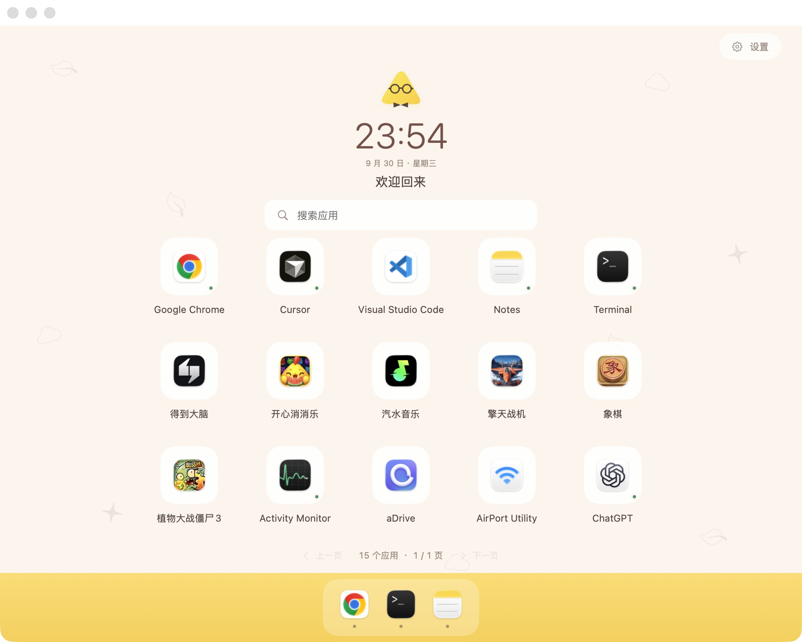
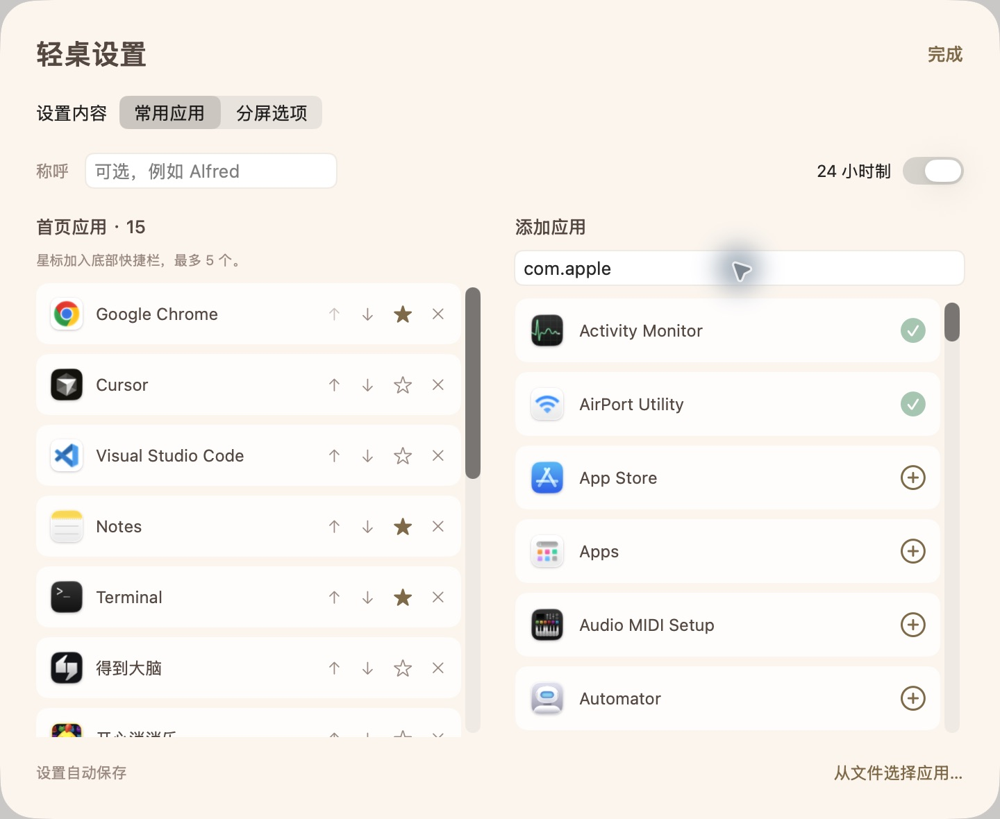

# QingDesk · 轻桌

[中文](README.md) · [Download](https://github.com/xiaoxipanda/qingdesk/releases/latest) · [Contributing](CONTRIBUTING.md) · [MIT License](LICENSE)


A lightweight native macOS home screen for your favorite apps. QingDesk combines a clock, an app grid, search, pagination, and a small shortcut dock. Click an app to launch it, even when it is absent from the desktop or the system Dock.

Built with SwiftUI and AppKit, with no third-party Swift packages or runtime dependencies. Requires macOS 14 or later.

## Why QingDesk

QingDesk began with a practical need: make apps easier to find when using computer-use agents. While exploring Hermes and cua-driver workflows, we wanted a clear, searchable launch point for apps that might be closed or absent from the desktop and Dock.

We brought favorite apps together on a simple home screen. People can click them directly; agents can find launch controls through app names, search, and accessibility identifiers. Search and pagination handle larger app collections, and window layouts help when a task needs multiple apps.

We want QingDesk to stay lightweight: simple configuration, a clear interface, native macOS capabilities, and optional window layouts and MCP integration. By sharing the project, we hope to work with others exploring computer use and make a shared desktop easier for people and agents to operate. A clear app launcher is one small step toward that goal.

## Screenshots

The home screen combines a clock, search, favorite apps, pagination, and a shortcut dock.



Settings let you find and add installed apps, reorder favorites, and star apps for the shortcut dock.



These are screenshots of the running app. The app list depends on your installed software and configuration.

## Install

Download `QingDesk-macOS.zip` from [Releases](https://github.com/xiaoxipanda/qingdesk/releases), extract it, and move `轻桌.app` to Applications or `~/Applications`.

The published binary targets Apple Silicon. Intel Macs can build from source; Intel hardware has not been tested.

The current binary is ad-hoc signed and has no Developer ID signature or Apple notarization. Gatekeeper may require additional confirmation or block a browser-downloaded app. Building from source is also supported.

## Use

1. Open settings using the gear in the upper-right corner.
2. Add installed apps, or select one or more `.app` bundles from a file picker.
3. Use the arrows to reorder favorites. Star up to five apps for the shortcut dock.
4. Return to the home screen and click an app to open it. Removing an entry does not uninstall the app.

The UI currently uses Chinese labels. App names come from the installed applications.

The grid only displays complete rows. The default window holds 15 apps per page, and smaller windows reduce the row count. Search by app name or bundle ID; press Return to launch a single search result.

Settings are stored locally at `~/Library/Application Support/Desktop Workbench/workspace.json`. The legacy directory and bundle identifier remain stable to preserve existing configurations.

## Computer use

The search field, launcher buttons, and pagination buttons have descriptive accessibility labels and stable identifiers, including `launcher.search`, `launcher.app.<bundle-id>`, and `launcher.next-page`.

A computer-use agent can read the QingDesk window, search for an app, read the updated state, click its launch button, then inspect the target app to confirm it opened. Read state again after every search, page change, or window resize: element indices, tokens, and screenshot coordinates may have changed.

Only the current page is instantiated in the accessibility tree. QingDesk provides discoverable launch controls; automation inside the target app depends on that app's own accessibility support.

## Optional window layouts

Settings include side-by-side, stacked, primary/secondary, four-window, and single-window layouts, with adjustable gaps and display selection. Window arrangement requires macOS Accessibility permission; ordinary app launching does not.

Layouts arrange regular desktop windows. They do not create system full-screen Split View or change Spaces. The app verifies window frames, attempts rollback if a target rejects its size, and can restore frames from the last successful layout. Full-screen windows, ambiguous window selection, or app-specific minimum sizes may prevent a layout.

## Build and test

Requires Swift 6 or later, Xcode or matching Command Line Tools, and Python 3.

```bash
git clone https://github.com/xiaoxipanda/qingdesk.git
cd qingdesk
swift test
bash scripts/build-app.sh
open "dist/轻桌.app"
```

The build produces `dist/轻桌.app` and `dist/QingDesk-macOS.zip`, with ad-hoc signing and executable permissions preserved. GitHub Actions runs unit tests, builds the app, and verifies ZIP extraction. Accessibility permissions and live window arrangement require local testing; see [CONTRIBUTING.md](CONTRIBUTING.md).

## Optional MCP server

The app bundles `workbench-mcp`, a stdio MCP server using a private local Unix socket. It has no network listener. Supported tools are `list_apps`, `ensure_app`, `apply_layout`, `get_workspace_state`, `launch_scene` for existing saved scenes, and `restore_layout`.

Configure your MCP client to run `/absolute/path/轻桌.app/Contents/MacOS/workbench-mcp` with no arguments. Launch and layout tools only accept apps added to favorites. The helper can start QingDesk in the background; use `--no-autostart` to disable that behavior. It does not start Hermes.

The service must run on the Mac being controlled. Closing the app window leaves the local service running; Quit stops it, and clicking the Dock icon reopens the home screen.

## License and artwork

Source code is released under the [MIT License](LICENSE). The app icon was generated with built-in imagegen; its [source](assets/QingDeskIcon.png) and [prompt](assets/icon-prompt.md) are included. Third-party app icons are read from locally installed apps. Names and icons visible in screenshots illustrate the interface and belong to their respective owners; this repository does not provide standalone assets or installers for those apps.
